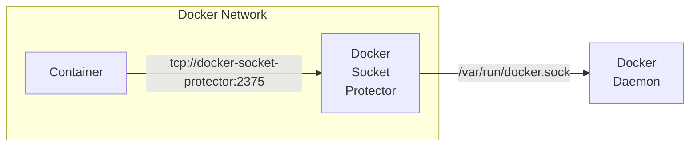

# Docker Socket Protector
Some containerized applications (e.g. portainer, traefik, watchtower, ouroboros) demand access to the Docker socket (`/var/run/docker.sock`). But exposing the Docker socket to a container basically equals giving it **full root privileges** to the host system. Especially when the application just needs to read some information via the Docker socket the access should be locked down. Docker Socket Protector can do this by limiting the control an application gets over the Docker daemon. Only the required functions will be exposed via a customized Docker socket. Therefore, this little program acts as a customizable filtering proxy.



## Setup

| Env Var      | Values           |                      |
|--------------|------------------|----------------------|
| LOG_REQUESTS | `true` / `false` | Whether requests are written to stdout. Useful to craft custom profiles.  |
| PROFILE      | See [predefined profiles](./profiles/)| The filename of the profile to apply rules from.  |

This software filters requests to the Docker socket based on a whitelist of rules. These rules are stored in a profile file. See [here](./profiles/) for examples shipped with the software. To allow all requests use the profile `unprotected`.

The restricted docker socket is provided via TCP on port 2375. See example below.

### Traefik Example Setup

Traefik is a modern reverse proxy with a great [docker integration](https://doc.traefik.io/traefik/providers/docker/). It extracts routing rules from container labels. Therefore, Traefik needs **readonly** access to the Docker socket.

```yaml
version: '3.9'

services:

  traefik:
    image: traefik
    command: "--providers.docker.endpoint=http://docker-socket-protector:2375"
    ports:
      - "80:80"
    networks:
      - docker_socket_net

  docker-socket-protector:
    image: knrdl/docker-socket-protector # or: ghcr.io/knrdl/docker-socket-protector
    hostname: docker-socket-protector
    read_only: true
    cap_drop: [ all ]
    environment:
      LOG_REQUESTS: "true"
      PROFILE: "traefik"
    volumes:
      - /var/run/docker.sock:/var/run/docker.sock
    networks:
      - docker_socket_net

networks:
  docker_socket_net:
    attachable: false
    internal: true
```

### Portainer Example Setup

[Portainer](https://docs.portainer.io/) is a container management web interface
with RBAC controls for standalone and Swarm based Docker hosts. Portainer
requires access to both disruptive and destructive API calls and two example
profiles are provided for a standalone Portainer instance; one profile is
**read-only**, while the other has **write** access. Following the Docker
Compose example YAML above, we can implement Portainer in a similar manner.

**DO NOT USE THIS EXAMPLE IN INTERNET FACING ENVIRONMENTS WITHOUT USING TLS
CERTIFICATES ON YOUR PORTAINER INSTANCE!!**

```yaml
version: '3.9'

services:

  portainer:
    image: portainer/portainer-ce:latest
    security_opt:
      - no-new-privileges:true
    command: "-H tcp://docker-socket-protector:2375"
    ports:
      - "9000:9000"
    networks:
      - docker_socket_net

  docker-socket-protector:
    image: knrdl/docker-socket-protector  # or: ghcr.io/knrdl/docker-socket-protector
    hostname: docker-socket-protector
    read_only: true
    cap_drop: [ all ]
    environment:
      LOG_REQUESTS: 'true'
      PROFILE: 'portainer-rw-whitelist'
    volumes:
      - /var/run/docker.sock:/var/run/docker.sock
    networks:
      - docker_socket_net

networks:
  docker_socket_net:
    attachable: false
    internal: true
```

### Crafting custom profiles

1. Record all requests to the Docker socket, e.g.: `docker run -it --rm -e PROFILE=unprotected -e LOG_REQUESTS=true -p127.0.0.1:2375:2375 -v /var/run/docker.sock:/var/run/docker.sock knrdl/docker-socket-protector`
2. Analyze the lines starting with "request rule:" and extract rules into regular expressions
3. Write a custom profile file "supersecure" and start the software with it, e.g.: `docker run -it --rm -e PROFILE=supersecure -e LOG_REQUESTS=true -p127.0.0.1:2375:2375 -v /var/run/docker.sock:/var/run/docker.sock -v $PWD/supersecure:/profiles/supersecure:ro knrdl/docker-socket-protector`
4. Test the profile, e.g.: `sudo DOCKER_HOST=tcp://localhost:2375 docker ps`

## FAQ

### Why not just mount the docker socket as read only? 
Mounting as `/var/run/docker.sock:/var/run/docker.sock:ro` (**ro** = readonly) just prevents the container from changing file permissions on the socket file. The socket as pipe object stays writable, so you can still send arbitrary requests to the socket. Nevertheless, using **ro** mode for socket mount is not wrong, but won't solve the security problem!
